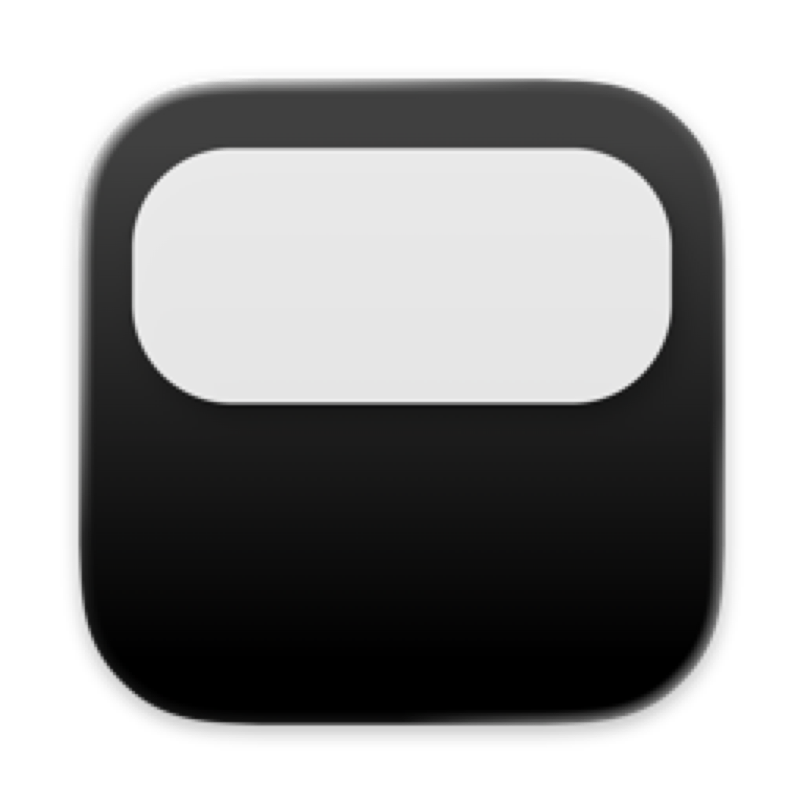

<div align="center">
  
  <h1 align="center">VibeHUD</h1>

  <p align="center">
    A privacy-first macOS notch overlay for tracking AI coding session status.
  </p>

[](https://github.com/section9-lab/VibeHUD/stargazers)
[](LICENSE)
[](https://github.com/section9-lab/VibeHUD/releases/latest)


[](https://ko-fi.com/jackvibe)
[](https://www.patreon.com/jack)

</div>

## What it does

VibeHUD gives Claude Code, Codex, and OpenCode a lightweight ambient status surface on macOS. The floating HUD shows which sessions are working or ready for input and can notify you with a sound when work finishes.

## Product highlights

- Live status HUD for multiple Claude Code, Codex, and OpenCode sessions
- Reliable lifecycle states for idle, processing, compacting, and ready for input
- Completion sounds that do not depend on opening the HUD
- Focus detected tmux sessions without opening or controlling conversations
- Choose your display, completion sound, Claude directory, and startup behavior
- Optional sensor helper for tap and vibration-based actions
- Built-in update checks and installs through Sparkle

## Main workflows

### Stay on top of active sessions

VibeHUD consumes lifecycle-only hook events and keeps the important state visible: running work, compaction, ready for input, and recently active sessions. It does not show or open conversation history.

### Hear when work finishes

When a session transitions to ready for input, VibeHUD plays your selected macOS system sound. Sound playback is driven by the central lifecycle state rather than the HUD view being open.

### Return to the right terminal

For detected tmux sessions, VibeHUD can focus the corresponding terminal window through yabai. It does not enter the conversation, click controls, or send input.

## Requirements

- macOS 15.6+
- Claude Code, Codex, or OpenCode installed

## Install

Download the latest release from the GitHub releases page and move `VibeHUD.app` into `/Applications`.

On first launch, VibeHUD installs lifecycle hooks for supported agents automatically.

Release downloads:
- https://github.com/section9-lab/VibeHUD/releases/latest

## Settings

From the notch menu, you can configure:

- preferred screen
- notification sound
- Claude config directory
- launch at login
- hooks on or off
- update checks and installs
- optional sensor helper access and sensitivity

## Compatibility

VibeHUD supports Claude Code, Codex, and OpenCode on macOS. Hooks report lifecycle state and terminal location metadata through a local Unix socket. Terminal focusing requires tmux and yabai; sensor interactions require the optional helper.

## Claude directory support

VibeHUD works with the current Claude config layout and can resolve the config directory from:

1. `CLAUDE_CONFIG_DIR`
2. the directory you pick in VibeHUD
3. `~/.config/claude`
4. `~/.claude`

## Updates

VibeHUD uses Sparkle for in-app updates, so installed builds can check for new versions and install them from the app.

## Privacy

VibeHUD does not read or store agent messages, conversation transcripts, tool input, or permission request content. It cannot approve or deny permissions, open chats, click conversation controls, or send messages.

Lifecycle hooks send only the session ID, working directory, agent source, lifecycle event, process/terminal location metadata, tmux metadata, and event ordering data to a local Unix socket.

VibeHUD uses Mixpanel for product analytics including app version, build number, and macOS version. Conversation content is never included.

## Build from source

For a release-style local build:

```bash
./scripts/build.sh
```

To package a notarized release DMG:

```bash
./scripts/create-release.sh
```

## License

Apache 2.0
